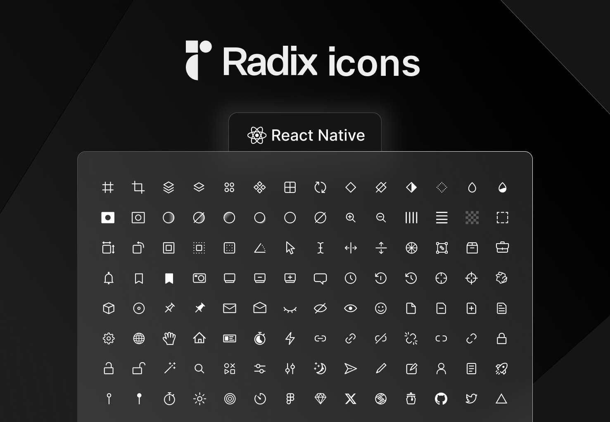

# Radix UI Icon Library for React Native



## Introduction

This library provides a React Native component for utilizing [Radix UI](https://www.radix-ui.com/icons) icons. It offers a simple and customizable way to include Radix UI icons in your React Native projects.

## Installation

To install the package, you can use npm:

```bash
npm install radix-ui-react-native-icons
```

Or, if you prefer using Yarn:

```bash
yarn add radix-ui-react-native-icons
```

## Features

- Customizable icon size and color
- Comprehensive support for all [Radix UI icons](https://www.radix-ui.com/icons) that you can use on the web

## Icon Naming Convention

The naming convention for the icons in this library is based on the Radix UI icons but adapted for React Native usage. 
To find the name of an icon you'd like to use, you can visit the [Radix UI Icons](https://www.radix-ui.com/icons) page.

### How to Adapt Radix UI Icon Names for React Native

The Radix UI icons are typically used in a React (web) environment with a specific component name, 
such as `<FontBoldIcon />`. To use the same icon in React Native with this library, you'll need to adapt the name to a string format and 
use it as the `name` prop in the `RadixIcon` component.

For example, if the Radix UI icon component is `<FontBoldIcon />`, you would use it in React Native as follows:

```jsx
<RadixIcon name="font-bold" />
```

## Dependencies

This library depends on the `react-native-svg` package to render SVG icons. If you haven't installed it yet, you'll need to add it to your project. [react-native-svg](https://www.npmjs.com/package/react-native-svg)

## Usage

Here's a quick example to show how you can use the `RadixIcon` component in your React Native application:

```bash
import React from 'react';
import { View } from 'react-native';
import { RadixIcon } from 'radix-ui-react-native-icons';

const App = () => {
  return (
    <View>
      <RadixIcon name="github-logo" size={24} color="black" />
    </View>
  );
};

export default App;

```

### Props

The `RadixIcon` component accepts the following props:

| Prop   | Type     | Required | Default | Description                                        |
|--------|----------|----------|---------|----------------------------------------------------|
| `name` | `string` | Yes      | N/A     | Specifies the name of the Radix UI icon to display.|
| `size` | `number` | No       | `24`    | Sets the size of the icon.                          |
| `color`| `string` | No       | `black` | Sets the color of the icon.                         |

## Get in Touch

If you have any questions, suggestions, or would like to contribute, feel free to reach out:

- **Twitter**: [imeronn](https://twitter.com/imeronn)
- **Portfolio**: [erencanarica.com](https://erencanarica.com)
- **Email**: [erencanarica0@gmail.com](mailto:erencanarica0@gmail.com)
  
## License

Copyright © 2022-present [WorkOS](https://workos.com/).

See [LICENSE](https://github.com/radix-ui/icons/blob/master/LICENSE) for more information.